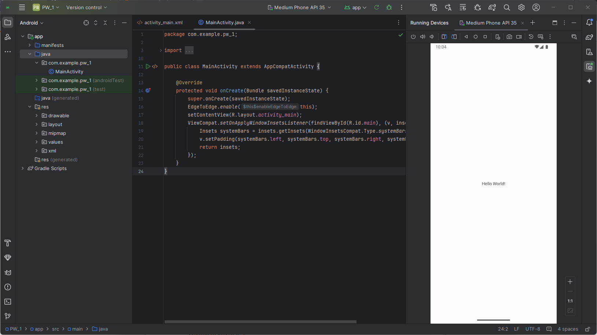
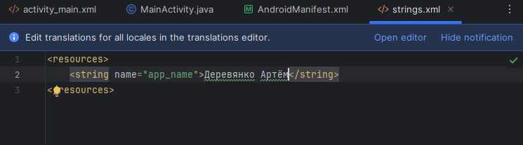
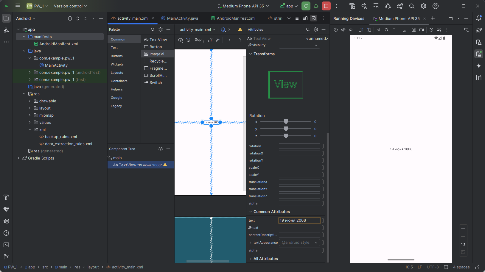

# Практическая работа №1 Знакомство с Android Studio
Выполнил: Деревянко Артём Владимирович ИНС-б-о-24-2
Вариант: 11

## Цель работы
Изучение интерфейса Android studio и создание первого простого приложения.

## Ход работы
1. В начале работы Android Studio был скачен, установлен и настроен согласно методичке. Создан и запущен новый проект "PW_1".

2. В имени приложения, путём изменения содержимого файла "strings.xml", было указано авторство.

На странице приложения указана дата рождения с помощью свойства страницы TextView.

3. Выполнениы все описанные в работе шаги. В частности отрисованы: прямоугольник, круг, отрезок и кривые с разным углом наклона. Координаты отрезка и кривых были изменены так, чтобы фигуры не лежали друг на друге. Выполнено задание согласно варианту: отрисован красный овал, с длиной вертикальной полуоси в 3 раза большей горизонтальной.
### Листинг 1. - класс `DrawView` для задания 3
```java
    class DrawView extends View {
        Paint p;
        Rect rect;

        public DrawView(Context context){
            super(context);
            p = new Paint();
            rect = new Rect();
        }

        @Override
        protected void onDraw(Canvas canvas){
            // Выполнение шагов, описанных в работе
            canvas.drawARGB(80, 102, 104, 255);

            p.setColor(Color.RED);
            canvas.drawRect(200, 105, 400, 200, p);

            canvas.drawCircle(100, 200, 50, p);

            p.setStrokeWidth(10);
            float[] points = new float[]{300, 300, 400, 300};
            canvas.drawLines(points, p);

            Path path = new Path();
            path.moveTo(50, 50);
            path.lineTo(0, 100);
            path.lineTo(100, 100);
            path.lineTo(50, 50);

            canvas.drawPath(path, p);

            Path path2 = new Path();
            path2.addArc(new RectF(0, 300, 100, 400), 0, 180);

            canvas.drawPath(path2, p);

            Path path3 = new Path();
            path3.addArc(new RectF(0, 225, 100, 325), 90, 180);

            canvas.drawPath(path3, p);


            // Задание 3 вариант 11 (красный овал)
            // Вычисление центра экрана:
            int canvasW = getWidth();
            int canvasH = getHeight();
            Point centerOfCanvas = new Point(canvasW / 2, canvasH / 2);

            // Определение размера овала:
            int ovalW = 150;
            int ovalH = ovalW * 3;
            // Расчёт координат овала относительно центра экрана:
            int offset = 800; // Смещение вверх отностиельно центра экрана
            int left = centerOfCanvas.x - (ovalW / 2);
            int top = centerOfCanvas.y - (ovalH / 2) - offset;
            int right = centerOfCanvas.x + (ovalW / 2);
            int bottom = centerOfCanvas.y + (ovalH / 2) - offset;
            // Создание и отрисовка овала:
            Path oval = new Path();
            oval.addArc(new RectF(left, top, right, bottom), 0, 360);
            canvas.drawPath(oval, p);
        }
    }
```


4. Выполнено задание 4 согласно варианту: отрисовать солнце со смайлом.
### Листинг 2. - class `DrawView` для задания 4
```java
    class DrawView extends View {
        Paint p;
        Rect rect;

        private String colorOrange = "#FFA500";
        private Paint paintYellow; // Краска солнца
        private Paint paintOrange; // Краска лучей
        private Paint paintWhite;  // Краска глаз и рта
        private Paint paintRay;    // Кисть для ломаных линий (лучей)
        private Paint paintOrangeEdging; // Кисть для окантовки солнца

        public DrawView(Context context){
            super(context);
            p = new Paint();
            rect = new Rect();

            paintYellow = new Paint();
            paintYellow.setColor(Color.YELLOW);
            paintYellow.setStyle(Paint.Style.FILL);

            paintOrange = new Paint();
            paintOrange.setColor(Color.parseColor(colorOrange));
            paintOrange.setStyle(Paint.Style.STROKE);
            paintOrange.setStrokeWidth(10);

            paintOrangeEdging = new Paint();
            paintOrangeEdging.setColor(Color.parseColor(colorOrange));
            paintOrangeEdging.setStyle(Paint.Style.STROKE);
            paintOrangeEdging.setStrokeWidth(25);

            paintWhite = new Paint();
            paintWhite.setColor(Color.WHITE);
            paintWhite.setStyle(Paint.Style.FILL);

            paintRay = new Paint();
            paintRay.setColor(Color.parseColor(colorOrange));
            paintRay.setStyle(Paint.Style.STROKE);
            paintRay.setStrokeWidth(25);
            paintRay.setAntiAlias(true);
        }

        @Override
        protected void onDraw(Canvas canvas){
            // Выполнение шагов, описанных в работе
            canvas.drawARGB(80, 102, 104, 255);

            p.setColor(Color.RED);
            canvas.drawRect(200, 105, 400, 200, p);

            canvas.drawCircle(100, 200, 50, p);

            p.setStrokeWidth(10);
            float[] points = new float[]{300, 300, 400, 300};
            canvas.drawLines(points, p);

            Path path = new Path();
            path.moveTo(50, 50);
            path.lineTo(0, 100);
            path.lineTo(100, 100);
            path.lineTo(50, 50);

            canvas.drawPath(path, p);

            Path path2 = new Path();
            path2.addArc(new RectF(0, 300, 100, 400), 0, 180);

            canvas.drawPath(path2, p);

            Path path3 = new Path();
            path3.addArc(new RectF(0, 225, 100, 325), 90, 180);

            canvas.drawPath(path3, p);


            // Задание 3 вариант 11 (красный овал)
            // Вычисление центра экрана:
            int canvasW = getWidth();
            int canvasH = getHeight();
            Point centerOfCanvas = new Point(canvasW / 2, canvasH / 2);

            // Определение размера овала:
            int ovalW = 150;
            int ovalH = ovalW * 3;
            // Расчёт координат овала относительно центра экрана:
            int offset = 800; // Смещение вверх отностиельно центра экрана
            int left = centerOfCanvas.x - (ovalW / 2);
            int top = centerOfCanvas.y - (ovalH / 2) - offset;
            int right = centerOfCanvas.x + (ovalW / 2);
            int bottom = centerOfCanvas.y + (ovalH / 2) - offset;
            // Создание и отрисовка овала:
            Path oval = new Path();
            oval.addArc(new RectF(left, top, right, bottom), 0, 360);
            canvas.drawPath(oval, p);


            // Задание 4 вариант 11 (Солнце)
            float radius = Math.min(canvasW, canvasH) / 3f;

            Path raysPath = new Path();
            int rayCount = 12;
            float outerRadius = radius * 1.5f;

            for (int i = 0; i < rayCount; i++) {
                double angle = (2 * Math.PI / rayCount) * i;
                // Точка на краю солнца
                float x1 = (float) (centerOfCanvas.x + radius * Math.cos(angle));
                float y1 = (float) (centerOfCanvas.y + radius * Math.sin(angle));
                // Точка на конце луча
                float x2 = (float) (centerOfCanvas.x + outerRadius * Math.cos(angle));
                float y2 = (float) (centerOfCanvas.y + outerRadius * Math.sin(angle));

                // Добавляем линию в путь (ломаная состоит из отрезков)
                raysPath.moveTo(x1, y1);
                raysPath.lineTo(x2, y2);
            }
            canvas.drawPath(raysPath, paintRay);

            // Солнце
            canvas.drawCircle(centerOfCanvas.x, centerOfCanvas.y, radius, paintYellow);
            canvas.drawCircle(centerOfCanvas.x, centerOfCanvas.y, radius, paintOrangeEdging);

            // Глаза
            float eyeOffset = radius / 3f;
            float eyeSize = radius / 10f;
            canvas.drawCircle(centerOfCanvas.x - eyeOffset, centerOfCanvas.y - eyeOffset, eyeSize, paintWhite);
            canvas.drawCircle(centerOfCanvas.x + eyeOffset, centerOfCanvas.y - eyeOffset, eyeSize, paintWhite);

            // Рот
            float mouthWidth = radius * 0.6f;
            float mouthHeight = radius * 0.3f;
            RectF mouthRect = new RectF(
                    centerOfCanvas.x - mouthWidth,
                    centerOfCanvas.y - eyeOffset,
                    centerOfCanvas.x + mouthWidth,
                    centerOfCanvas.y + eyeOffset + mouthHeight
            );
            canvas.drawArc(mouthRect, 0, 180, false, paintWhite);
        }
    }
```


## Вывод
В ходе практической работы был изучен интерфейс Android studio и создано первое простоге приложение.
